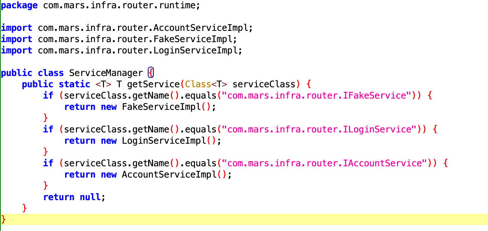

# MarsRouter    

### 概述      
路由小玩具，主要包含以下部分：
1. 页面跳转
2. 服务发现
3. 自动赋值

### 如何使用    
#### 1、引入插件    
在根build.gradle文件中，添加classpath
```groovy
    dependencies {
        ...
        classpath("com.mars.infra:mars-router-plugin:0.3.0")
    }
``` 
在app的build.gradle文件中，apply插件
```kotlin
plugins {
    ...
    id("kotlin-kapt")
    id("com.mars.infra.router.plugin.v2")
}
```     
#### 2、示例一       
需求描述：在主页面调起登录页面
1、在`LoginActivity`类上，添加注解    
`@RouterUri`：标识LoginActivity对应的uri
`@Builder`和`@Inject`：自动赋值，与Dagger中的Inject功能类似
```kotlin
@RouterUri(module = "login", path = "/login")
@Builder
class LoginActivity : Activity() {

    ...

    @Inject
    lateinit var username: String

    @Inject
    lateinit var password: String

    override fun onCreate(savedInstanceState: Bundle?) {
        ...
        mTvUserName.text = username
        mTvPassword.text = password
    }
}
```        
2、主页面调用   
```kotlin
class MainActivity : AppCompatActivity() {

    override fun onCreate(savedInstanceState: Bundle?) {
        ...

        mBtnStartLogin.setOnClickListener {
            Router.loadUri(this, UriRequest().apply {
                uri = "/login"
                param1 = "张三"
                param2 = "123"
            })
        }
    }
}
```           
#### 3、示例二         
需求描述：在登录页面，调用登录SDK方法
```kotlin
@RouterUri(module = "login", path = "/login")
@Builder
class LoginActivity : Activity() {

    @Inject
    lateinit var username: String

    @Inject
    lateinit var password: String

    override fun onCreate(savedInstanceState: Bundle?) {
        super.onCreate(savedInstanceState)
        setContentView(R.layout.activity_login)

        mBtnLogin.setOnClickListener {
            login()
        }

        mTvUserName.text = username
        mTvPassword.text = password
    }

    private fun login() {
        Router.getService(ILoginService::class.java)?.also {
            Log.e("mars", "LoginActivity--->ILoginService = $it")
        }?.login()
    }
}
```   
- 通过调用`Router.getService(ILoginService::class.java)`可以获取到`ILoginService`对应的实现类`LoginServiceImpl`对象，如果获取不到，会降级到`EmptyLoginServiceImpl`
- Router.getService
```kotlin
    fun <T> getService(serviceClass: Class<T>): T? {
        val serviceImpl = ServiceManager.getService(serviceClass)
        if (serviceImpl != null) {
            return serviceImpl
        }
        val downgradeImpl = DowngradeManager.getDowngradeImpl(serviceClass)
        if (downgradeImpl != null) {
            return downgradeImpl
        }
        return null
    }
```  
- 反编译apk，可以看到ServiceManager


      
### TODO      
- [x] 静态注册，优化运行时反射性能消耗
- [x] gradle插件单独成library
- [x] gradle.kts
- [x] 支持组件间方法调用
- [x] 支持方法降级
- [ ] transform多线程
- [ ] SPI支持单例
- [ ] 代码优化